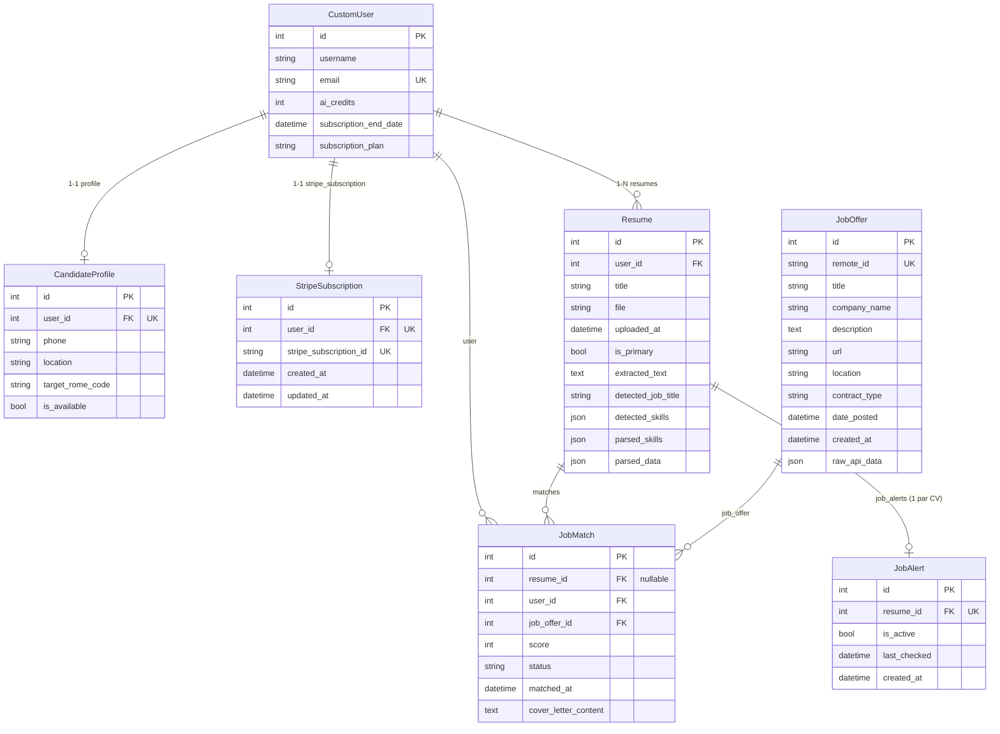

# Schéma de la base de données JobPilot

Diagramme Mermaid pour visualiser les modèles Django et leurs relations.

## Diagramme ER (Entity Relationship)

## Légende

| Symbole | Signification |
|---------|---------------|
| `\| \|--o\|` | Un à un (OneToOne) |
| `\| \|--o{` | Un à plusieurs (OneToMany / ForeignKey) |
| PK | Primary Key |
| UK | Unique |
| FK | Foreign Key |

## Résumé des modèles

| Modèle | App | Description |
|--------|-----|-------------|
| **CustomUser** | users | Utilisateur (email, crédits IA, abonnement) |
| **CandidateProfile** | users | Profil candidat (téléphone, lieu, code ROME, disponibilité) |
| **Resume** | resumes | CV (fichier, texte extrait, compétences détectées par IA) |
| **StripeSubscription** | subscriptions | Lien abonnement Stripe ↔ utilisateur |
| **JobOffer** | matching | Offre d'emploi (API France Travail) |
| **JobMatch** | matching | Match CV ↔ Offre (score, statut, lettre de motivation) |
| **JobAlert** | matching | Alerte email pour nouvelles offres (par CV) |

## Contraintes importantes

- **JobMatch** : `unique_together (resume, job_offer)` — un même CV ne peut matcher qu'une fois par offre.
- **JobAlert** : une seule alerte par CV (contrainte métier sur `resume`).
- **CandidateProfile** et **StripeSubscription** : un enregistrement maximum par utilisateur (OneToOne).
